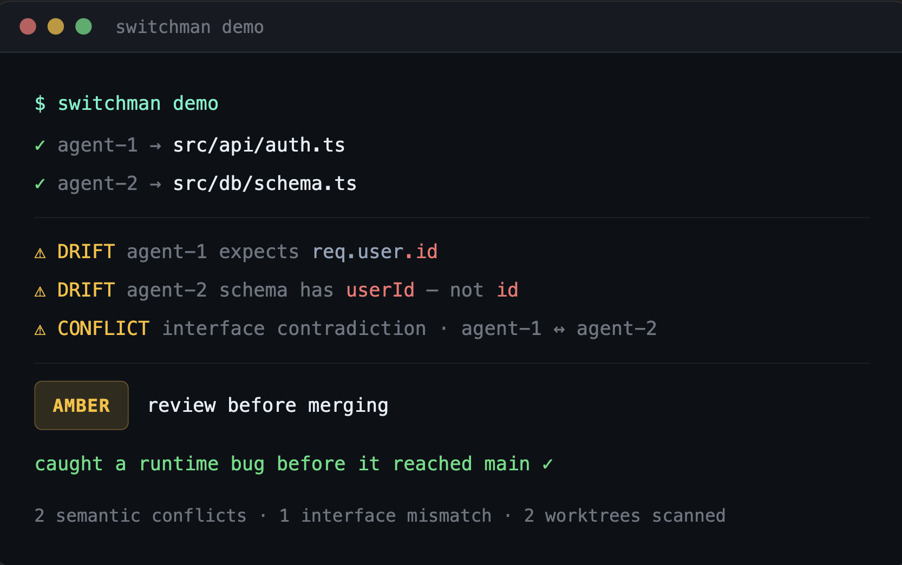

# Switchman

**The operating system for parallel AI development.**

[](https://github.com/switchman-dev/switchman/actions/workflows/ci.yml)
[](https://www.npmjs.com/package/switchman-dev)



When you run multiple AI agents on the same repo, they collide, duplicate work, and create risky merges. Switchman gives them leases, scoped ownership, policy gates, queue planning, and governed landing workflows so they can move in parallel without stepping on each other.

Questions or feedback? Join the [Discord](https://discord.gg/pnT8BEC4D) · [hello@switchman.dev](mailto:hello@switchman.dev)

---

## Install

Requirements: Node.js 22.5+ · Git 2.5+

```bash
npm install -g switchman-dev
```

Homebrew release path:

```bash
brew install switchman-dev/tap/switchman-dev
```

If you're cutting a release, generate the formula with:

```bash
switchman advanced brew-formula --sha256 <release-tarball-sha> --output Formula/switchman-dev.rb
```

> Switchman uses the built-in `node:sqlite` runtime — no extra database to install or manage.

---

## Try It In 2 Minutes

```bash
switchman demo
```

Creates a throwaway repo and shows:

- agent1 claiming `src/auth.js`
- agent2 getting blocked from the same file
- agent2 rerouting safely to `docs/auth-flow.md`
- both branches landing cleanly through the queue

Then inspect it:

```bash
cd /tmp/switchman-demo-...
switchman status
switchman queue status
```

---

## Quickstart

```bash
cd my-project
switchman start "Implement auth helper"
switchman status --watch
switchman gate ci
switchman queue run
```

What `switchman start` gives you:

- repo context-aware task planning
- linked agent workspaces
- a shared Switchman database in `.switchman/`
- a repo-aware `CLAUDE.md` when one does not exist

Prefer the older explicit flow when you want full manual control:

```bash
switchman setup --agents 3
switchman task add "Implement auth helper" --priority 9
```

Fastest path to success:

1. Use Claude Code for the first run
2. Run `switchman verify-setup` to confirm editor wiring
3. Run `switchman claude refresh` if you want to regenerate the repo-aware `CLAUDE.md`
4. Open one Claude Code window per generated workspace
5. Use `switchman start` for the shortest path, or add tasks manually if you want tighter control
6. Keep `switchman status --watch` open in a separate terminal
7. Run `switchman gate ci && switchman queue run` when tasks finish

Editor setup guides:

- [Claude Code](docs/setup-claude-code.md)
- [Cursor](docs/setup-cursor.md)
- [Windsurf](docs/setup-windsurf.md)

---

## Switchman Pro

> **Shared coordination depth · AI planning · 90-day history · $19/month**  
> [switchman.dev/pro](https://switchman.dev/pro) · or run `switchman upgrade`

Free now includes unlimited local agents, Slack notifications, read-only session summaries, and one shared cloud project for logged-in users. Pro adds deeper shared coordination, richer analysis, AI planning, and longer audit history.

```bash
switchman upgrade        # open switchman.dev/pro
switchman login          # activate after subscribing
switchman login --status # check your plan
```

**What's in Pro:**

- Deeper shared cloud coordination across machines
- AI task planning — `switchman plan "Add authentication" --apply`, `switchman plan --issue 47`, and optionally `--comment` back to the issue or PR
- Counterfactual session analysis
- 90-day audit trail (free: 7 days)
- Full team coordination beyond the free shared-project limit
- Email support within 48 hours

**$19/month per seat** · [switchman.dev/pro](https://switchman.dev/pro)

---

## Why Switchman?

Git gives you branches. Switchman gives you coordination.

Branches and worktrees solve isolation — they do not tell you:

- which task each agent should take next
- who already owns a file
- whether a session is stale
- whether finished work is safe to land

Switchman adds:

- **Task planning** — break goals into governed parallel work
- **File locking** — parallel edits don't quietly collide
- **Live status** — see what's running, blocked, or stale
- **Stale recovery** — abandoned work gets detected and requeued
- **Governed landing** — finished work reaches `main` one item at a time with retries and policy checks

Switchman is for the point where "we can manage this by hand" stops being true.

---

## Real-World Walkthrough

Three goals arrive at once: harden auth, ship a schema update, refresh docs.

```bash
switchman start "Harden auth middleware, ship the schema migration, and update the related docs" --agents 5
switchman status --watch
```

`switchman start` reads repo context, proposes the initial work split, and boots the session. If you prefer to drive the queue by hand, you can still fall back to explicit task adds:

```bash
switchman setup --agents 5
switchman task add "Harden auth middleware" --priority 9
switchman task add "Ship schema migration" --priority 8
switchman task add "Update auth and schema docs" --priority 6
```

Agents pick up work in separate workspaces. If two reach for the same file, Switchman blocks the second claim early. When branches finish:

```bash
switchman queue add agent1
switchman queue add agent2
switchman queue add agent3
switchman queue run --follow-plan --merge-budget 2
```

Before merge:

```bash
switchman gate ci
```

What good looks like:

- each agent stayed in its own lane
- overlap was blocked before wasted work spread
- the queue made it obvious what should land now and what should wait
- the repo reached `main` through a governed path

---

## Enforcement Gateway

Switchman is strongest when agents write through the governed gateway instead of editing files directly.

- MCP agents should prefer `switchman_write_file`, `switchman_append_file`, `switchman_make_directory`, `switchman_move_path`, and `switchman_remove_path`
- CLI operators can use `switchman write` and `switchman wrap`
- `switchman monitor` runs automatically in the background to catch rogue edits

---

## If something feels stuck

```bash
switchman status          # main dashboard
switchman status --watch  # live view
switchman scan            # conflict scan
switchman gate ci         # repo gate check
```

Explain commands:

```bash
switchman explain claim src/auth/login.js
switchman explain queue <item-id>
switchman explain stale --pipeline <pipeline-id>
switchman explain landing <pipeline-id>
```

More help:

- [Status and recovery](docs/status-and-recovery.md)
- [Merge queue](docs/merge-queue.md)
- [Pipelines and PRs](docs/pipelines.md)
- [Telemetry](docs/telemetry.md)
- [Command reference](docs/command-reference.md)

---

## PR Checks

Block risky changes in GitHub the same way your local terminal does:

```bash
switchman gate install-ci
```

Installs `.github/workflows/switchman-gate.yml` — runs the repo gate on every push and PR.

---

## Change Policy

Enforce review or validation for high-risk areas like auth, schema, or payments:

```bash
switchman policy init-change
switchman policy show-change
```

---

## What's next

- Zero-argument `switchman plan` — reads full repo context automatically
- Live web dashboard for repo and agent visibility
- Homebrew install path

---

## What's included today

- Agent worktree setup and repo verification
- Lease, claim, heartbeat, and stale-reap coordination
- Governed write gateways and rogue-edit monitor
- Repo status, repair, queue planning, and safe landing
- Pipeline planning, execution, PR bundles, and GitHub sync
- Audit trail, change policy enforcement, and CI integration
- MCP support for Claude Code, Cursor, and Windsurf

---

## Feedback

Building this in public. If you hit something broken or missing, I'd love to hear about it.

- [GitHub Issues](https://github.com/switchman-dev/switchman/issues)
- [hello@switchman.dev](mailto:hello@switchman.dev)

## License

MIT
